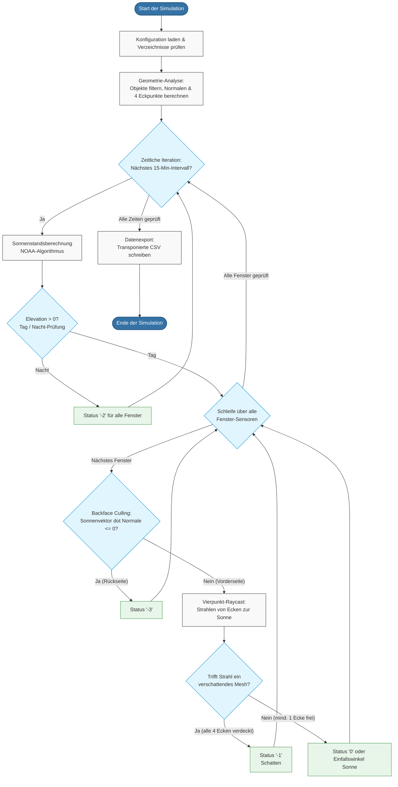

```mermaid
graph TD
    %% Styling
    classDef startEnd fill:#3572A5,stroke:#2b5c85,stroke-width:2px,color:#fff;
    classDef process fill:#f9f9f9,stroke:#333,stroke-width:1px;
    classDef decision fill:#e1f5fe,stroke:#0288d1,stroke-width:1px;
    classDef result fill:#e8f5e9,stroke:#388e3c,stroke-width:1px;

    %% Nodes & Flow
    Start([Start der Simulation]) --> Init[Konfiguration laden & Verzeichnisse prüfen]
    Init --> Geo[Geometrie-Analyse:<br>Objekte filtern, Normalen & 4 Eckpunkte berechnen]
    
    Geo --> LoopTime{Zeitliche Iteration:<br>Nächstes 15-Min-Intervall?}
    
    LoopTime -- Ja --> NOAA[Sonnenstandsberechnung<br>NOAA-Algorithmus]
    NOAA --> IsDay{Elevation > 0?<br>Tag / Nacht-Prüfung}
    
    IsDay -- Nacht --> NightState[Status '-2' für alle Fenster]
    NightState --> LoopTime
    
    IsDay -- Tag --> LoopWindow{Schleife über alle<br>Fenster-Sensoren}
    
    LoopWindow -- Nächstes Fenster --> Culling{Backface Culling:<br>Sonnenvektor dot Normale <= 0?}
    
    Culling -- "Ja (Rückseite)" --> CullingState[Status '-3']
    CullingState --> LoopWindow
    
    Culling -- "Nein (Vorderseite)" --> Raycast[Vierpunkt-Raycast:<br>Strahlen von Ecken zur Sonne]
    
    Raycast --> CheckHit{Trifft Strahl ein<br>verschattendes Mesh?}
    
    CheckHit -- "Ja (alle 4 Ecken verdeckt)" --> ShadowState[Status '-1' <br>Schatten]
    CheckHit -- "Nein (mind. 1 Ecke frei)" --> SunState[Status '0' oder Einfallswinkel <br>Sonne]
    
    ShadowState --> LoopWindow
    SunState --> LoopWindow
    
    LoopWindow -- Alle Fenster geprüft --> LoopTime
    
    LoopTime -- Alle Zeiten geprüft --> Export[Datenexport:<br>Transponierte CSV schreiben]
    Export --> End([Ende der Simulation])

    %% Zuweisung der Klassen (Kompatibler Weg am Ende der Datei)
    class Start,End startEnd;
    class Init,Geo,NOAA,Raycast,Export process;
    class LoopTime,IsDay,LoopWindow,Culling,CheckHit decision;
    class NightState,CullingState,ShadowState,SunState result;
```